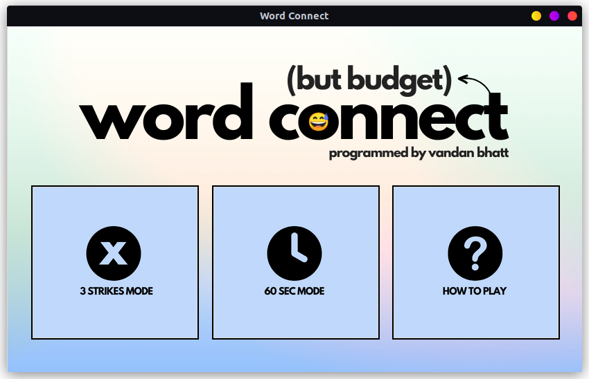
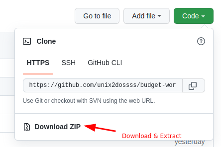

# Budget Word Connect

<p align="center">
  
</p>

## Project Overview

I was inspired to create this project when I saw my mom playing 'Word Connect' on her phone. I took on this project as a capstone to further grasp python concepts. I thought the project was simple, yet challenging enough to learn new things along its journey. I was able to utilise file-handling, api/json data; and also further understood the Tkinter library.

* Main Menu Screen
* How to Play Screen
* Custom UI Graphics
* Three-Strikes & Sixty-Second-Timer Mode
* Previews Currently Selected letters
* Selected letters are disabled upon click
* Game Checks

| ▶️ | [Project Showcase Video](https://github.com/unix2dossss/budget-word-connect/issues/new)

## Basic Instructions (Modes)

The general idea of the game is to create words from a given set of randomly generated letters. I've programmed 2 different game modes to give slightly more variety to the player. Modes: Three-Strikes and Sixty-Second-Timer. 

1. **Three-Strikes**: The objective of this game mode is to completely fill up all the slots with words _without getting 3-Strikes_.

    * A strike is given whenever a word that doesn't exist in the English Dictionary is submitted.
    * The strikes are indicated by red squares in the bottom left of the screen. Each time the user gets a strike, a green box is turned to red.
    * When all the boxes have turned red, it is game-over.
<br>

2. **Sixty-Second-Timer**: The objective of this game mode is to completely fill up all the slots with words _before the 60 seconds have run out_.

    * The 60-Seconds will begin as soon as the user has clicked on the mode. Be prepared to start submitting words. Fill up all slots to win the game.

## Download and Play

1. Make sure your system has Python installed. Install Python at [python.org](https://www.python.org/downloads/). Check if you have Python installed by typing the command ```python``` and pressing enter in your command prompt or terminal. If a prompt like ```>>>``` shows up, then Python is installed.
<br></br>

2. You can check if Git is installed on your system by typing ``git`` in the terminial; if no errors are returned, it is installed. If git is installed you can simply copy & paste the commands below to play the game ... (if Git is not installed, **Skip to Step 3**)

    ```bash
    git clone https://github.com/unix2dossss/budget-word-connect.git
    cd budget-word-connect
    python3 main.py 
    ```
    - if ``python3`` returns an error, try ``python``.
<br>

3. If Git is not installed on your system, you can simply download and extract the zip.

<p align="center">
  
</p> 

    cd budget-word-connect
    python3 main.py

## Bugs or Issues

If you find a bug or have an issue with Budget Word Connect, feel free to [Submit an Issue](https://github.com/unix2dossss/budget-word-connect/issues/new).